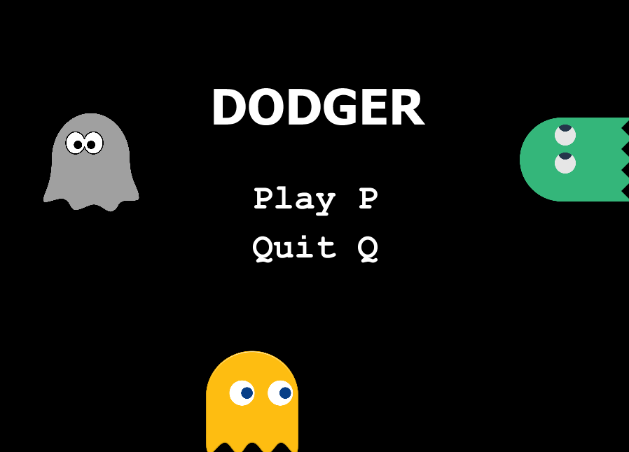
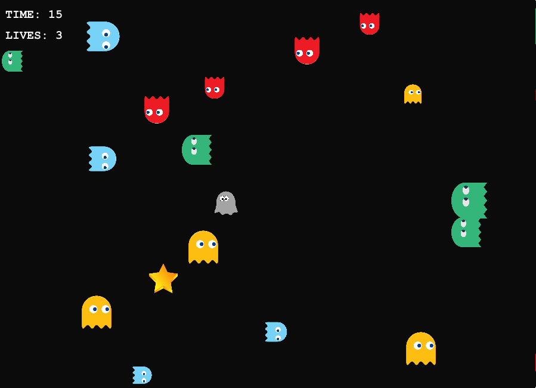
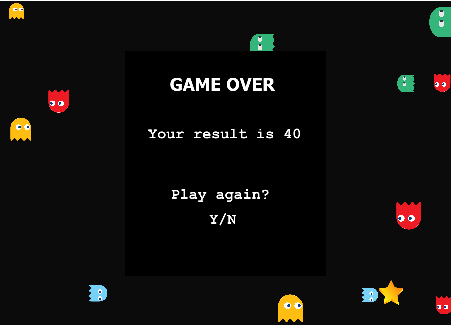

# Dodger

The player must dodge (avoid) a bunch of enemies that fall from all sides of the screen. The longer the player can keep avoiding the bodies of enemies,
the higher the score will get. The player is controlled with the arrow keys ↑ ↓ → ←.

 

## Technologies used

+ Clojure functional programming language
+ Quil library for creating interactive drawings and animation
+ Kibit code analyzer

## Getting Started

In order to run the project a small amount of prerequisites and additional steps have to be fulfilled.

### Prerequisites

+ Intellij IDE (or any other IDE supporting Clojure) installed
+ Cursive plugin installed (for Intellij IDE)

